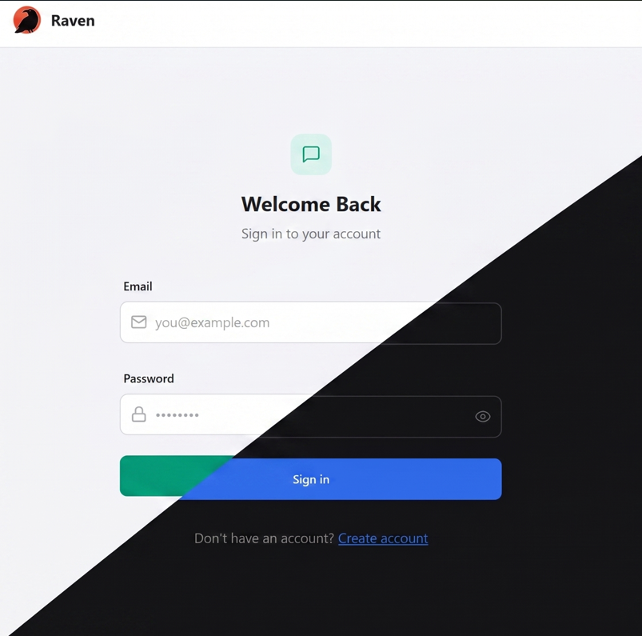

# 🐦 Raven - Realtime Chat & Messaging App

A modern, feature-rich full-stack realtime chat application built with the **MERN** stack (MongoDB, Express, React, Node.js), **Socket.io**, **AWS S3**, **Zustand**, and **TailwindCSS / DaisyUI**.



---

## ✨ Features

- ⚡ **Real-Time Messaging**: Bi-directional instant messaging with low latency using Socket.io.
- 🟢 **Live Online Status**: Real-time detection and display of online/offline user status.
- 🔒 **Secure Authentication**: JWT-based authentication via secure `httpOnly` cookies with Bcrypt password hashing.
- 📧 **Email Verification**: OTP-based email verification using Nodemailer (with graceful console fallback for local development).
- ☁️ **AWS S3 Cloud Storage**: Secure media and attachment storage using AWS S3 SDK v3 for profile avatars and file attachments (images, PDFs, documents).
- 📁 **File & Image Sharing**: Send images and document attachments in chat with automatic client-side image compression and direct browser download support.
- ⚡ **State Management**: Lightweight, reactive global state using Zustand.
- 🚀 **Performance & Scalability**: Optimized MongoDB query indexing, API pagination, and lazy asset loading.

---

## 🛠️ Tech Stack

### Frontend
- **Framework**: React 18 + Vite
- **Styling**: TailwindCSS, DaisyUI
- **State Management**: Zustand
- **Realtime**: Socket.io-client
- **Icons & Alerts**: Lucide React, React Hot Toast
- **HTTP Client**: Axios

### Backend
- **Runtime**: Node.js, Express.js
- **Database**: MongoDB with Mongoose ODM
- **Realtime Server**: Socket.io (handshake authenticated via JWT cookies)
- **File Storage**: AWS SDK v3 (`@aws-sdk/client-s3`), Multer
- **Email Service**: Nodemailer (SMTP / Gmail Integration)
- **Auth & Security**: JSON Web Tokens (JWT), Cookie-Parser, BcryptJS, CORS

---

## 🚀 Getting Started

### Prerequisites

Ensure you have the following installed on your local machine:
- [Node.js](https://nodejs.org/) (v18+ recommended)
- [MongoDB](https://www.mongodb.com/) (Local instance or MongoDB Atlas URI)
- [AWS S3 Bucket](https://aws.amazon.com/s3/) (for media storage)

---

### Environment Setup

Create a `.env` file in the `backend` directory with the following variables:

```env
# Server Configuration
PORT=5001
NODE_ENV=development

# Database
MONGODB_URI=your_mongodb_connection_string

# Authentication
JWT_SECRET=your_jwt_secret_key

# AWS S3 Configuration
AWS_REGION=your_aws_region
AWS_ACCESS_KEY_ID=your_aws_access_key_id
AWS_SECRET_ACCESS_KEY=your_aws_secret_access_key
AWS_S3_BUCKET_NAME=your_s3_bucket_name

# Email Verification (Optional - Console fallback will be used if omitted)
GMAIL_USER=your_email@gmail.com
GMAIL_PASS=your_app_password
```

---

### Installation & Local Running

1. **Clone the repository**:
   ```bash
   git clone https://github.com/RIKKY-J/Raven-Messaging-App.git
   cd Raven-Messaging-App
   ```

2. **Install all dependencies**:
   ```bash
   # Install backend & frontend dependencies
   npm run build
   ```

3. **Start the application**:

   - **Development Mode** (Run frontend and backend concurrently):
     ```bash
     # Backend dev server (from /backend directory)
     cd backend && npm run dev

     # Frontend dev server (from /frontend directory)
     cd frontend && npm run dev
     ```

   - **Production Mode**:
     ```bash
     npm start
     ```

---

## 📁 Project Structure

```
Raven-Messaging-App/
├── backend/
│   ├── src/
│   │   ├── controllers/    # Auth and Message request handlers
│   │   ├── lib/            # DB connection, Socket.io, S3 client, utility functions
│   │   ├── middleware/     # JWT authentication middleware
│   │   ├── models/         # Mongoose User, Message, Verification schemas
│   │   ├── routes/         # Express API routes
│   │   └── index.js        # Server entry point
│   └── package.json
│
├── frontend/
│   ├── src/
│   │   ├── components/     # UI components (ChatHeader, MessageInput, Sidebar, etc.)
│   │   ├── constants/      # Theme lists and static data
│   │   ├── lib/            # Axios instance and helper utilities
│   │   ├── pages/          # Home, Login, SignUp, Settings, Profile pages
│   │   ├── store/          # Zustand state stores (useAuthStore, useChatStore, useThemeStore)
│   │   ├── App.jsx         # App component with routing & auth check
│   │   └── main.jsx        # Entry point
│   └── package.json
│
├── vercel.json             # Vercel deployment configuration
├── package.json            # Root scripts
└── README.md
```

---

## 🤝 Contributing

Contributions, issues, and feature requests are welcome! Feel free to check the [issues page](https://github.com/RIKKY-J/Raven-Messaging-App/issues).

---

## 📜 License

This project is licensed under the [ISC License](LICENSE).
